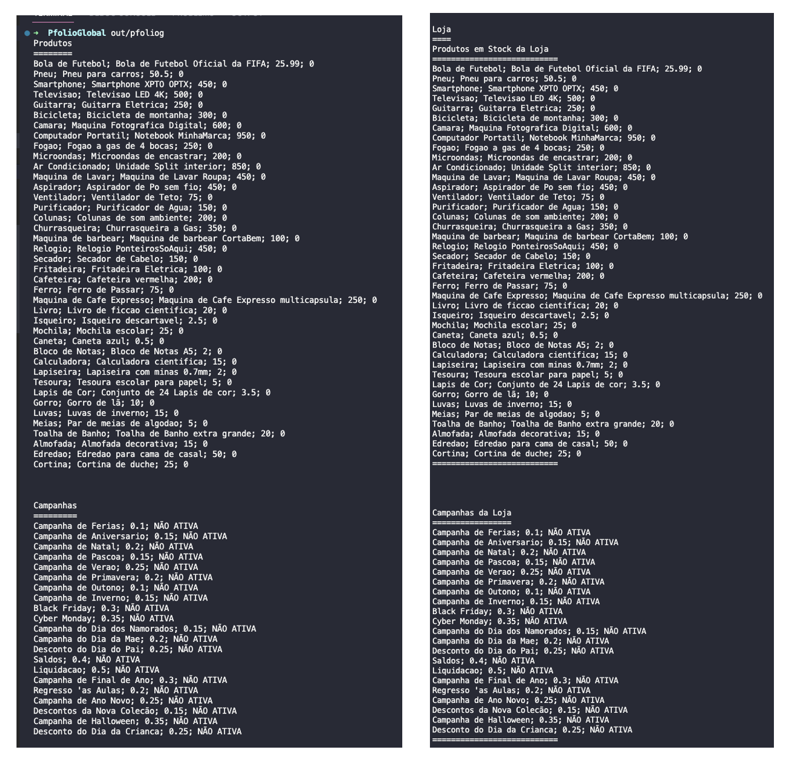

<h1 align="center">
    
</h1>

Pfolio Global de Programação por objetos - 21093 da UAb

📌 Programa listas de produtos e campanhas
------------------
1. O ficheiro produtos.csv, em anexo, tem uma lista de produtos físicos vendidos por uma loja online: nome, descrição e preço.

- a. Defina uma classe “Produto”, destinada a representar um produto, com um método “Ler” que recebe como parâmetro um stream e um método “Escrever”, sem parâmetros. Os atributos devem ser privados e inicializados como cadeias de texto vazias ou zero.
- b. Implemente o método “Ler” para carregar do stream para os atributos: o nome, a descrição e o preço do produto.
- c. Implemente o método “Escrever” para apresentar no ecrã o nome, a descrição e o preço do produto, na mesma linha.
- d. O ficheiro descontos.csv tem uma lista de campanhas promocionais: título da campanha e percentagem de desconto. Faça e implemente uma classe “Campanha” semelhante à classe produto, para campanhas.

2. Implemente um main() que:
- a. abra o ficheiro produtos.csv e o ficheiro descontos.csv e
- os leia para arrays de objetos Produto e Campanha,
- respetivamente.
- b. Apresente no ecrã as listas de produtos e de campanhas.

3. Defina uma classe Loja, tendo em conta as classes anteriores, que:
- a. Tem uma lista de objetos ProdutoDeLoja, que descende da classe Produto mas tem também o stock disponível.
- b. Tem uma lista de objetos CampanhaAtiva, que descende de Campanha mas tem também a indicação (bool) se está ativa ou não.

4. Defina operadores “+” para juntar produtos e campanhas a uma Loja.

5. Atualize o main() para criar uma Loja e carregar-lhe, com os operadores, os produtos e campanhas lidos dos ficheiros.
 
Para compilar colocamos na pasta principal o ficheiro CMakeLists e no terminal escrevemos: 
 
<strong>cmake -S . -B out</strong> 
<strong>cmake --build out</strong> 
 
<strong>OU</strong> 
 
<strong>cmake -S . -B out</strong>  
<strong>cd out </strong> 
<strong>make</strong> 

tambem na pasta src podemos compilar direto com o Gcc na linha de comandos escrevemos: 
<strong>g++ *.cpp -o pfoliog -std=c++17</strong> 
 

🔧 Tecnologias utilizadas:
------------------

- <strong>C++</strong>
- <strong>Visual Studio Code</strong>
- <strong>QtCreator</strong>
- <strong>CMake</strong>
- <strong>Gcc</strong>
- <strong>MacOS</strong>

💬 Fale comigo
------------------
[*Entre em contato comigo*](https://www.linkedin.com/in/ivo-baptista-3712144/)

